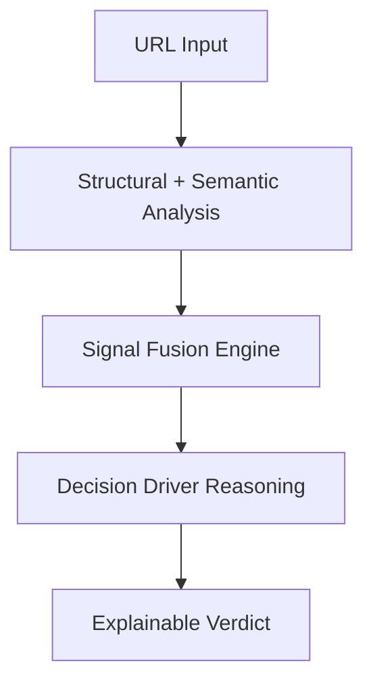

# 🛡️ ThreatLens v1.5
> **Real-time URL risk analysis with explainable decision intelligence.**

### Enterprise-Ready Security Intelligence System


---

## 🖥️ Dashboard Preview


*Modern, state-driven security intelligence dashboard providing full signal transparency.*

---

## 🎥 Demo


*Watch ThreatLens analyze stealth infrastructure in real-time.*

---

## 🚀 What's New in v1.5 (The "Decision System" Update)

We've evolved from a research prototype to an enterprise-ready security intelligence system. v1.5 introduces:

- **🧠 Decision Driver Engine**: A dedicated reasoning layer that explains *why* the system reached its verdict. 
- **📈 Visual Math Decomposition**: Full transparency into score calculation. `AI Baseline` + `Heuristic Signal Boost` = `Final Risk`.
- **🟣 State-Driven Semantic UI**: Intelligent handling of network conditions.
  - **FULL**: Deep inspection available.
  - **RESTRICTED**: Content analysis blocked (anti-bot triggers).
  - **OFFLINE**: Domain unreachable; fallbacks to structural heuristics.
- **🕸️ GNN Structural Analysis (Adaptive)**: Applies graph-based reasoning when multi-node structures (redirect chains) are available, using masked pooling to prevent signal dilution.
- **⚖️ Trust-Aware Overall Certainty**: A top-level confidence metric that intelligently downgrades itself when critical data signals are missing, preventing false trust.

---

## 🔄 System Flow



---

## 🧠 Why ThreatLens?

Unlike traditional blacklist-based tools:

- **Explains why** a URL is dangerous (Structural vs Semantic vs Network).
- **Adapts to incomplete data**: Works even for unreachable or bot-protected domains.
- **Signal-Fusion Architecture**: Combines structural topology with semantic intent.
- **Prioritizes trust over blind scoring**: High confidence on verified infrastructure roots.

---

## 💼 Use Cases

- **Slack / Teams link security**: Real-time link validation in corporate channels.
- **Safe Link-Sharing**: Workspace intelligence for collaborative tools (Notion, Docs).
- **Security Awareness**: Educational tool showing *why* a link is suspicious.
- **Browser Protection**: Lightweight on-demand link analysis via extension.

---

## 📊 Performance (Internal Evaluation)

| Metric | Value | Testing Notes |
| :--- | :--- | :--- |
| **False Positive Rate** | **~0.1 - 1.0%** | Samples from Tranco Top 10K Domains |
| **Detection Recall** | **~90.0 - 95.0%** | Synthetic + known phishing patterns |
| **Avg Latency** | **~100 - 150ms** | Local inference environment |
| **System Stability** | **High** | Graceful fallback handling (NXDOMAIN/403) |

---

## ⚠️ Limitations

- **Content Analysis**: May be unavailable for domains with aggressive anti-bot protection.
- **Graph Depth**: GNN structural reasoning is optimized for redirect chains and nested subdomains; limited for flat, single-node URLs.
- **Scope**: Focuses purely on URL string mapping and basic scraping; does not analyze in-page DOM elements or visual pixel-similarity.
- **Live Feeds**: Direct threat intelligence API integration (VirusTotal/PhishTank) is planned for v2.

---

## 📂 Project Structure

- `backend/`: FastAPI server with async multiprocessing for high-throughput prediction.
- `src/`: Modern React dashboard with state-driven UI logic and a "Security-Native" aesthetic.
- `extension/`: Chrome Extension for on-demand link analysis.
- `data/`: Config-driven intelligence (brands, keywords, TLDs).

---

## ⚡ Quick Start

### 1. Start the Intelligence Engine
```bash
cd backend
python -m venv venv
source venv/bin/activate  # or venv\Scripts\activate
pip install -r requirements.txt
uvicorn app:app --host 0.0.0.0 --port 8000
```

### 2. Launch the Dashboard
```bash
npm install
npm run dev
```

---
**ThreatLens v1.5** | AI-driven security intelligence for the modern workspace.